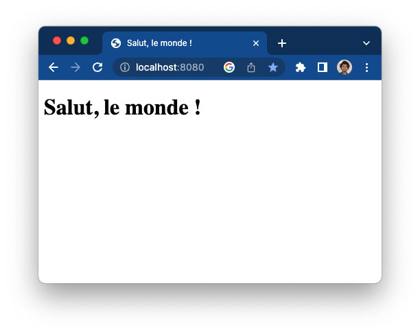

# Spring Hello World

Une application web tout simple avec Spring-Boot.  
Voir la classe [HelloRestController.java](src/main/java/com/oxiane/springhelloworld/rest/HelloRestController.java)

## Lancement

Ce dépôt embarque le [Maven Wrapper](https://maven.apache.org/wrapper/) : seul un JDK 11+ est nécéssaire pour compiler et lancer l'application.

### Méthode 1 : Lancement simple via le Spring-Boot-Maven-Plugin :
````
./mvnw spring-boot:run
````

### Méthode 2 : Compilation du jar livrable et lancement

````
./mvnw package && java -jar target/*.jar
````

## Et voilà !



## Redéfinition de la *System property* au *runtime*

````
java -jar target/*.jar '--salutation=Yo !'
````

